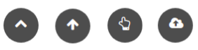

# MyScrollUp

[(https://codeclimate.com/github/sOM2H/my_scroll_up.png)](https://codeclimate.com/github/sOM2H/my_scroll_up)


Customizable scroll up for monolith projects.



Preview: https://myscrollup.herokuapp.com/
## Installation

Add this line to your application's Gemfile:

```ruby
gem 'jquery-rails'
gem 'my_scroll_up'
```

And then execute:

    $ bundle install
    $ rails g my_scroll_up:install

If you don't use bootstrap, then add this line to your head:

```html
...
<link href="//netdna.bootstrapcdn.com/font-awesome/3.2.1/css/font-awesome.css" rel="stylesheet">
...
```


Add this code to your body:

`app/views/layouts/application.html.erb`


```erb
  ...
  <%= MyScrollUp.render.html_safe %>
  ...
```
Add requirements to js and css:

`app/assets/javascripts/application.js`

``` js
  ...
  //= require jquery
  //= require my_scroll_up
  ...
```

`app/assets/stylesheets/application.css`

```css
  ...
  *= require my_scroll_up
  ...
```
## Usage:

You can customize your icon style:

You can choose an icon from https://fontawesome.com/v3.2.1/icons/

(Default 'icon-chevron-up')


`app/config/initializers/my_scroll_up.rb`

```ruby
MyScrollUp.configure do |config|
  # Set icon style example
  # config.icon = 'icon-chevron-up'
end
```

## License

The MIT License
